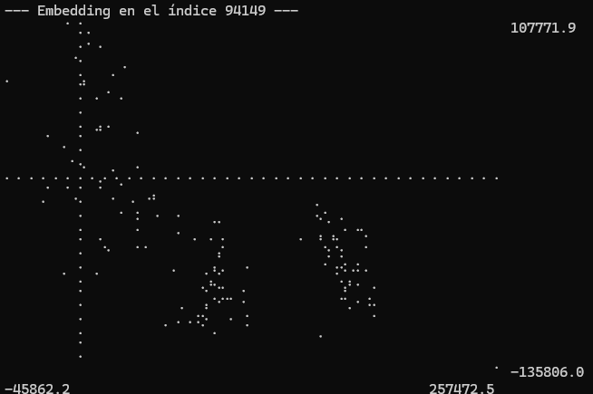

# umap-mcqueen

Reducción de dimensiones a tiempo real y *offline* por medio de UMAP e implementado en Rust para mayor eficiencia en recursos y tiempo.

----

El algoritmo usado es ' fast-umap ', una implementación de UMAP en Rust que a parte de ser mucho más veloz, es paramétrica, por lo que rompe con la limitación usual de UMAP que es no poder aceptar nuevos datos en base a un encaje ya realizado.

Después de ser reducidos de dimensionalidad, se usa un algoritmo de clustering usual.

Su única funcionalidad actual es tomar un archivo ' .csv ' e iterar sobre sus datos sólo aplicando UMAP por lotes. Lo siguiente es TODO:

- Realizar el clustering final.
- Mostrar a color las clasificaciones.
- Implementar la lectura a tiempo real de un *web socket*.

-----

## Características deseables

- Codigo mínimo.
- Funcionalidades mínimas.
- Adaptable a otros módulos.
